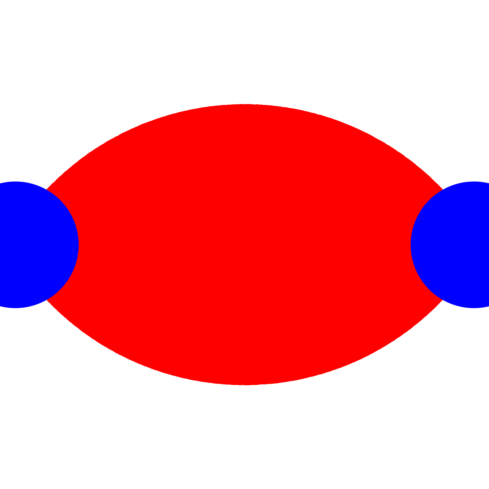

<h1>find_between</h1>

`find_between` finds particles (of the first target) between two other particles (of the second target) subject to constraints on the total distance and angle formed between the two vectors.

```
find_between <name of trajectory list to create> <distance cutoff> <cosine theta cutoff> <only-different-molecule flag>
<target1>
<target2>
```

<h3 align="center">2D illustration of find_between. Developed for Kawak, Bhapkar, Simmons. _Macromolecules_ 57 (2024).<br/>
        doi: <a href="https://pubs.acs.org/doi/10.1021/acs.macromol.4c00489#fig1">10.1021/acs.macromol.4c00489</a></h3>

<table>
  <tr>
    <td align="center" width="25%">
      
      <br/>
      <sub>dist\_cutoff=4.0; costheta\_cutoff=0.0; Vectors and angle for a sample point</sub>
    </td>
    <td align="center" width="25%">
      
      <br/>
      <sub>dist\_cutoff=4.0; costheta\_cutoff=-0.5</sub>
    </td>
    <td align="center" width="25%">
      
      <br/>
      <sub>dist\_cutoff=5.0; costheta\_cutoff=0.0</sub>
    </td>
    <td align="center" width="25%">
      
      <br/>
      <sub>dist\_cutoff=5.0; costheta\_cutoff=0.5</sub>
    </td>
  </tr>
</table>


As can be seen by the illustration above, AMDAT will compute two vectors with an atom from the first target (`<target1>`) as the center with two atoms from the second target (`<target2>`).
The distance and angle formed between these two vectors.
