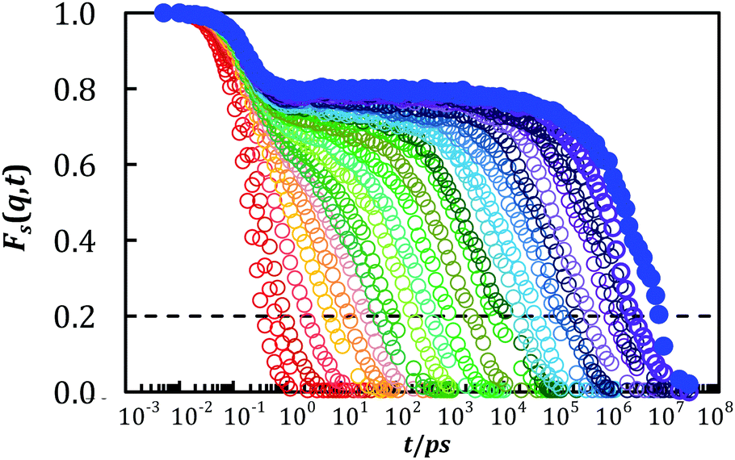

# AMDAT — Amorphous Molecular Dynamics Analysis Toolkit

> High-performance analysis of molecular dynamics (MD) trajectories for amorphous, glass-forming, and polymer systems.

AMDAT is a C++ toolkit that loads trajectories into memory for **rapid** analysis, with robust **atom selection**, **time-resolved** statistics, and modular data objects.
It reads common LAMMPS trajectory formats and GROMACS `.xtc`.
It provides a wide variety of high-performance analyses integral to molecular modeling studies, such as clustering, spatial decomposition, and calculating time-resolved structure factors, mean-square displacements, radial distribution functions, etc.

[](https://github.com/dssimmons-codes/AMDAT)
[](https://dssimmons-codes.github.io/AMDAT/)
[](https://doi.org/10.5281/zenodo.17417167)
[](LICENSE)
[](https://sites.google.com/view/simmonsresearchgroup/software)

## Why AMDAT (at a glance)

* Fast, in-memory engine – load once, analyze many time delays without re-reading files.
* Blocked exponential time spacing – efficient long-timescale dynamics across orders of magnitude.
* Modular data abstractions – trajectory / neighbor / multibody / value lists compose into rich workflows.
* Validated analyses –
  * static and time-resolved structure factors,
  * radial distribution functions,
  * mean-square displacements,
  * neighbor correlations,
  * clustering, and more.
* Plain-text outputs – easy post-processing in Python/Matlab/Excel/VMD/OVITO.

*More details in the [Overview](Manual/overview.md).*

## Quick start (Linux, Conda)

### Build with conda environment (Recommended)
```bash
make conda-setup
conda activate amdat
make
```

### Run
```bash
./AMDAT -i path/to/input.in
```

*More details in [Build/Install](Manual/making_amdat.md).*

## Highlights

<table>
  <tr>
    <td align="center" width="25%">
      <a href="Manual/displacement_list.md">
        
      </a><br/>
      <sub>Identification of highly mobile particles<br/>(image: Pierre Kawak)</sub>
    </td>
    <td align="center" width="25%">
      <a href="Manual/displacement_list.md">
        
      </a><br/>
      <sub>Particle displacements (2D LJ)<br/>(image: Pierre Kawak)</sub>
    </td>
    <td align="center" width="25%">
      <a href="Manual/create_bin_list.md">
        
      </a><br/>
      <sub>Sorting by distance from a nanoparticle/interface<br/>(image: Pierre Kawak)</sub>
    </td>
    <td align="center" width="25%">
      <a href="Manual/n_fold.md">
        
      </a><br/>
      <sub>6-fold orientational order parameter (2D LJ)<br/>(image: Daniel Hunsicker)</sub>
    </td>
  </tr>
</table>

<table>
  <tr>
    <td align="center" width="50%">
      <a href="Manual/msd.md">
        
      </a><br/>
      <sub>
        Mean-square displacement for bead-spring polymer<br/>
        doi: <a href="https://doi.org/10.1039/C8SM02051E">10.1039/C8SM02051E</a><br/>
        (image: Sean Hung)
      </sub>
    </td>
    <td align="center" width="50%">
      <a href="Manual/isfs.md">
        
      </a><br/>
      <sub>
        Time-resolved structure factor peak for bead-spring polymer<br/>
        doi: <a href="https://doi.org/10.1039/C8SM02051E">10.1039/C8SM02051E</a><br/>
        (image: Sean Hung)
      </sub>
    </td>
  </tr>
</table>

## Citation

If you use AMDAT, please cite:
> AMDAT — Amorphous Molecular Dynamics Analysis Toolkit
> DOI: 10.5281/zenodo.17417167

*Also see [CITATION.cff](CITATION.cff).*

## Authors & Maintainers
* Lead: [David S. Simmons](https://github.com/dssimmons)
* Maintainers: [Pierre Kawak](https://github.com/pkawak) · [William Drayer](https://github.com/drayer587)
* Contributors: [Michael Marvin](https://github.com/magico13) · Mark Mackura · Daniel Hunsicker

## License
GNU GPLv3.0 (see [LICENSE](LICENSE)).
It bundles:
* Voro++ (see [Voro++ LICENSE](third_party/voro++-0.4.6/LICENSE))
* xdrfile (LGPL-3.0, see [xdrfile LICENSE](third_party/xdrfile-1.1b/COPYING))

## Contributing
We welcome issues, discussions, and pull requests.
Please skim [CONTRIBUTING.md](CONTRIBUTING.md) first.
